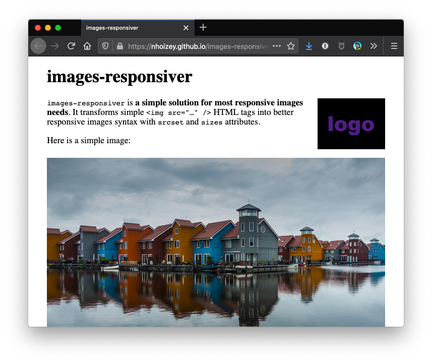

| **[<< Back home](/images-responsiver/#documentation)** | **[< Installation](/images-responsiver/installation.html)** |

# Tutorial step 1: Default behavior without images-responsiver

----

- **Step 1: Default behavior without `images-responsiver`**
- [Step 2: Better behavior with `images-responsiver` and default configuration](https://nhoizey.github.io/images-responsiver/tutorial-02-images-responsiver-default.html)
- [Step 3: Enhanced behavior with some configuration](https://nhoizey.github.io/images-responsiver/tutorial-03-images-responsiver-simple-configuration.html)
- [Step 4: Making it more robust with image dimensions](https://nhoizey.github.io/images-responsiver/tutorial-04-images-dimensions.html)
- [Step 5: Dealing with images filenames and URLs](https://nhoizey.github.io/images-responsiver/tutorial-05-images-urls.html)
- [Step 6: Even better responsive images](https://nhoizey.github.io/images-responsiver/tutorial-06-even-better-responsive-images.html)

----

Let's say you have this HTML file:

And this CSS file:

We want the content to occupy 90% of the available space (but no more than `40em`, better for readability of multi-lines text), and the logo to use 50% of this content width, floated on the right.

You can [open it here](https://nhoizey.github.io/images-responsiver/examples/01-without-images-responsiver/page.html):

The page looks exactly how you want, thanks to the clean HTML structure and the CSS rules.

But each image is available in only one single dimension (large probably), even if people with many different devices/browsers, with different viewport widths, would rather download only what's necessary.

Now let's try to run `images-responsiver` on the HTML to enhance it.

| **[Tutorial step 2 >](/images-responsiver/tutorial-02-images-responsiver-default.html)** | **[Back home >>](/images-responsiver/#documentation)** |
